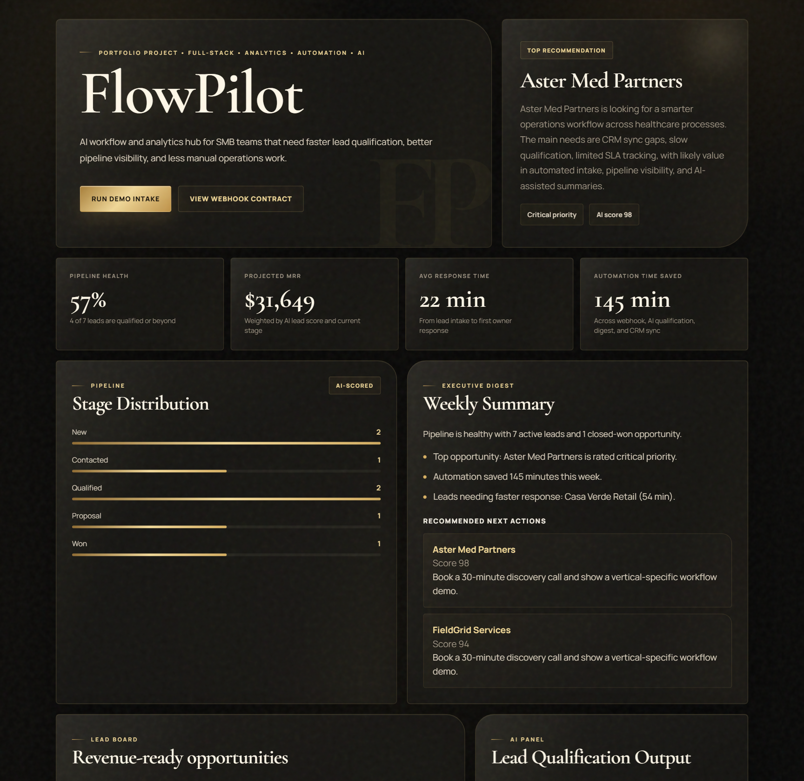
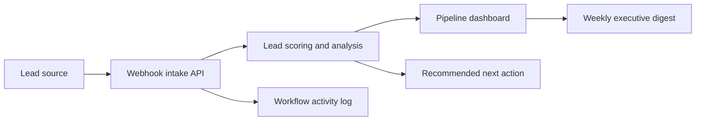

# FlowPilot

**AI-assisted revenue operations dashboard for small and medium-sized businesses.**

FlowPilot is a full-stack MVP that helps sales and operations teams respond to inbound
leads faster, understand pipeline health, and reduce repetitive CRM work.



## The problem

Growing businesses often receive leads from websites, campaigns, referrals, and external
tools. The information ends up scattered across spreadsheets, inboxes, and CRM systems.

This creates several business problems:

- valuable leads wait too long for a response;
- teams qualify opportunities inconsistently;
- managers cannot quickly understand pipeline health;
- CRM updates and weekly reports consume hours of manual work;
- decisions are made without a clear view of revenue potential.

## The solution

FlowPilot brings lead intake, qualification, analytics, and workflow activity into one
dashboard.

When a new lead arrives, the system can:

1. Accept the lead through a webhook designed for tools such as n8n.
2. Calculate a transparent priority score from stage, source, company size, and budget.
3. Generate a concise summary and recommended next action.
4. Update pipeline metrics and an executive weekly digest.
5. Record the automation run and estimated time saved.

The result is a clearer and faster workflow from inbound request to sales action.

## Who it is for

- small and medium-sized businesses with growing inbound lead volume;
- sales operations and revenue operations teams;
- founders who need a simple executive pipeline view;
- agencies that connect websites, CRMs, APIs, and automation workflows.

## Business value demonstrated

- faster lead response through automated intake and routing;
- consistent lead qualification and prioritization;
- better visibility into projected monthly recurring revenue;
- fewer manual CRM and reporting tasks;
- clear recommended next actions for high-value opportunities.

> FlowPilot is currently a portfolio MVP with demo data. It demonstrates the product
> workflow and technical architecture rather than claiming production results.

## Features

- KPI dashboard for pipeline health, projected MRR, response time, and time saved;
- revenue-focused lead board with transparent AI-assisted scores;
- weekly executive digest with insights and recommended actions;
- workflow timeline for webhook intake, CRM sync, and qualification events;
- `POST /api/automation/intake` webhook endpoint for n8n or another automation tool;
- optional OpenAI integration for live lead analysis;
- local heuristic fallback, so the demo works without API costs;
- responsive premium black-and-gold interface.

## Architecture



## Tech stack

- **Backend:** Node.js native HTTP server
- **Frontend:** HTML, CSS, and JavaScript
- **Analytics:** custom pipeline metrics and lead-scoring logic
- **AI layer:** local heuristic analysis with optional OpenAI API integration
- **Automation:** webhook contract designed for n8n integration
- **Data layer:** in-memory demo dataset for the MVP

## API endpoints

| Method | Endpoint | Purpose |
| --- | --- | --- |
| `GET` | `/api/overview` | Dashboard metrics and pipeline overview |
| `GET` | `/api/leads` | Lead list with qualification scores |
| `GET` | `/api/workflows` | Automation activity history |
| `GET` | `/api/reports/weekly` | Executive weekly digest |
| `POST` | `/api/leads/:id/analyze` | AI-assisted analysis for a selected lead |
| `POST` | `/api/automation/intake` | Webhook intake for n8n or external tools |
| `POST` | `/api/automation/run-demo` | Create a demo intake event |

## Run locally

Requirements: Node.js 20 or newer.

```bash
node server.mjs
```

Then open:

```text
http://localhost:3000
```

On Windows, `START_FLOWPILOT.cmd` can also start the server and open the application.

## Optional OpenAI setup

Set the environment variables before starting the server:

```powershell
$env:OPENAI_API_KEY="your-key"
$env:OPENAI_MODEL="gpt-4.1-mini"
node server.mjs
```

Without an API key, FlowPilot uses the local scoring and analysis fallback.

## Example webhook payload

```json
{
  "name": "Alicia Moran",
  "company": "Nordline",
  "industry": "Logistics",
  "budgetRange": "12000-20000",
  "monthlyRevenuePotential": 6400,
  "message": "Need AI lead routing and reporting."
}
```

## Roadmap

- persist data in PostgreSQL;
- add authentication and role-based access;
- integrate with a real CRM;
- create and export real n8n workflows;
- add automated tests and CI;
- containerize and deploy a public demo;
- measure real response-time and conversion improvements.

## Author

**Maksim Poperechnyuk**  
Full-Stack Developer and Data Analyst  
Email: [slowsliwa@gmail.com](mailto:slowsliwa@gmail.com)

